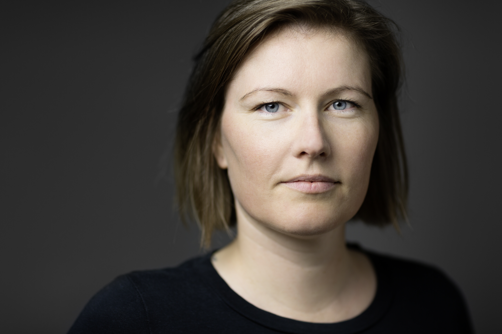

## About Me

I am a third year PhD student in the evolutionary biology group of [Jens Rolff](https://www.bcp.fu-berlin.de/en/biologie/arbeitsgruppen/zoologie/ag_rolff/people/rolff/index.html).
I am interested in the evolution of metamorphosis in insects. Holometabolous insects drastically reconstruct their entire body. That reconstruction gives the insect the unique opportunity to drive an almost complete change between the larval and adult microbiota. Further holometaboly decouples growth and differentiation and therefore facilitates fast growth. For my PhD I am studying both: the microbiota turnover and fast growth in holmetabolous insects.

## Curriculum Vitae

<a href="CM_CV_Dec21_2.html">My full CV</a>

2017-present
**PhD Evolutionary Biology** Freie Universität Berlin (Berlin, Germany)

2015-2017
**MSc Biodiversity, Evolution, and Ecology** Freie Universität Berlin (Berlin, Germany)

2016
**Visiting Master student** Uppsala University, Department of Ecology and Genetics, Limnology (Uppsala, Sweden)

2012-2017
**Teaching Assistant** Freie Universität Berlin, Institute of Biology, Department Zoology (Berlin, Germany)

2011-2015
**BSc Biology** Freie Universität Berlin (Berlin, Germany)

2013
**Exchange Bachelor student** Norwegian University of Science and Technology (Trondheim, Norway)
